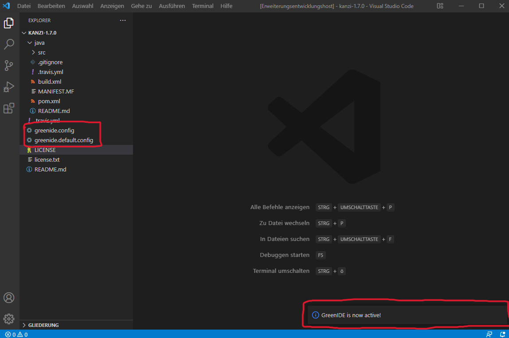
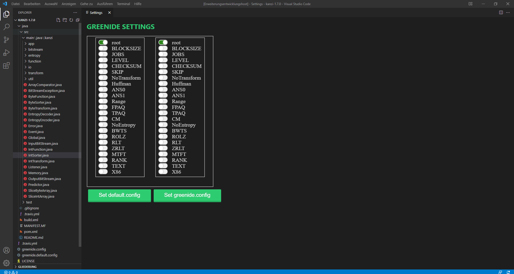
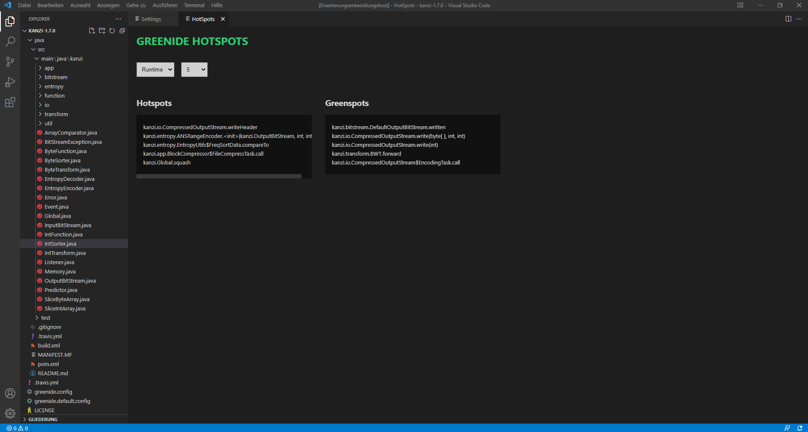
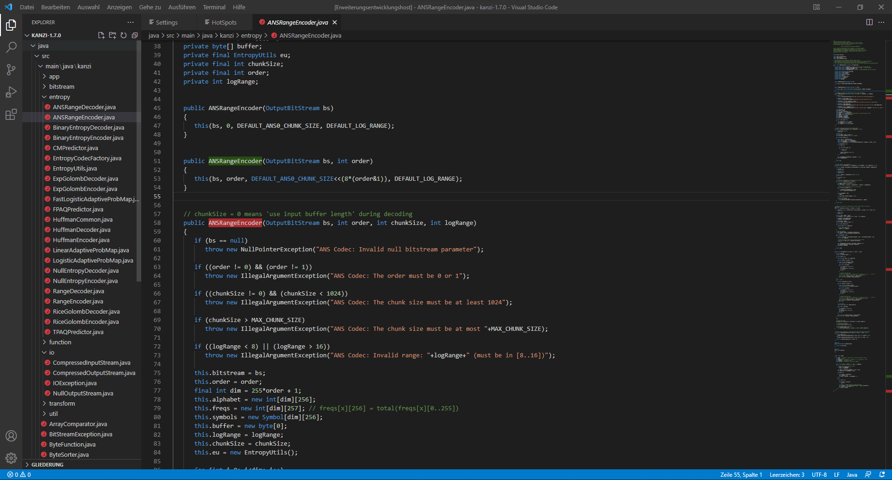
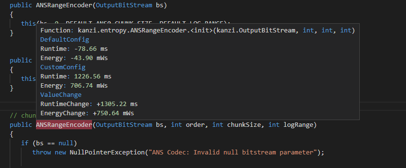

# Welcome to GreenIDE

  

## What is GreenIDE?
GreenIDE is extension developed to work with Visual Studio Code, in effort to help software developers understand and reduce power consumption of every code line. This extension will take configurations of a software into consideration to put out direct feedback on how much time would one specific function to execute, as well of how power consuming the function is, therefore developers can make necessary changes to reduce how much energy a program would cost.
  
## Functions
- GreenIDE can identify hotspot code, where a function with a specific configuration would require much more energy and runtime than average.
- By hovering your click point on a function of your choice, you would know how much energy is needed for the execution and how long would it take.
- You can change a program's configuration by editing the configuration file.
- You can display a number of hotspots and greenspots and lead them to the respective Java class 
- The colors of the messages you receive are adapted to your theme, whereas it is dark mode or normal mode.

## Setting up
- To download the current extension, go to the pipelines and open up the package_extension job or <a href="https://git.informatik.uni-leipzig.de/swtp-21-22/swt-p-ws-2020-2021/swtp-2021-13/-/jobs/artifacts/main/download?job=package_extension">click here</a>.
- Then click on download to download the job artifact
- The downloaded ZIP-Folder contains the .vsix extension file
- In Visual Studio  go to the "extension" window (menu on the left) and click on the three dots in the top right corner
- Then you can click on "Install from VSIX" and select the downloaded .vsix file

## How to use the extension
1. Open your project folder (kanzi, density).
2. GreenIDE is started by itself as soon as the correct projektornder is opened.
- To detect if GreenIDE is started, a message will appear in the lower right corner and two configuration files will be created in the projector. 
3. Now open the settings window by pressing <kbd>CTRL</kbd>+<kbd>SHIFT</kbd> +<kbd>P</kbd> and writing `greenide.config` now a new window will open
- 
- In this window all settings can be selected as desired and must be confirmed with the lower buttons
4. After the settings have been made, you can open the hotspots window by pressing <kbd>CTRL</kbd>+<kbd>SHIFT</kbd> +<kbd>P</kbd> and writing `greenide.hotspots`
- 
- In this window you can choose between runtime and energy and set the number of hotspots/greenspots to be displayed.
- Now you get a list of the biggest hotspots and greenspots. With a click on the names you can go directly to the Java class.
5. If you now open a Java class or have been guided into one by step 4, you will see the hotspots (red) and greenspots (green) marked in color in the text and in the scrollbar.
- 
6. Now you can hover over the marked and of course also over unmarked functions and display the runtime and energy usage.
- 

## Release notes
### 1.0.0
Initial release of GreenIDE

  

  
